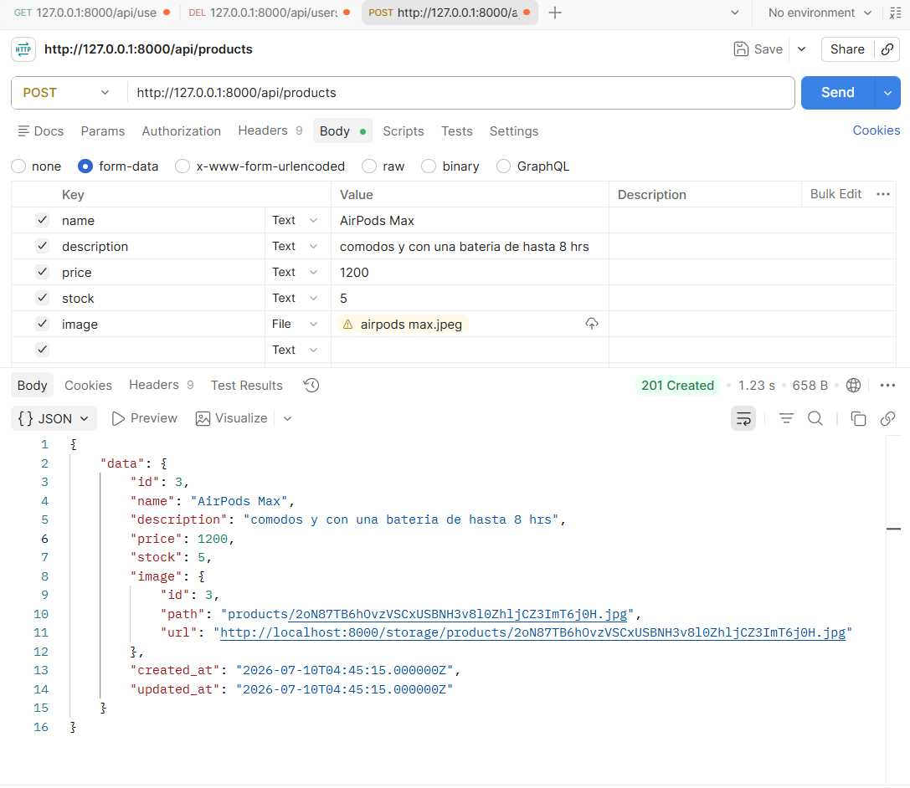
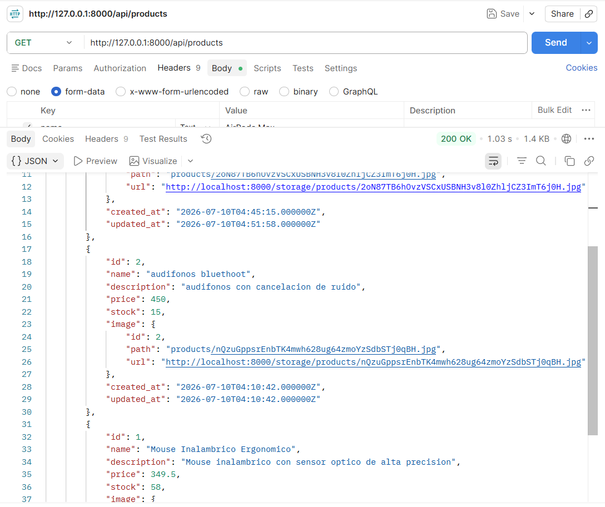
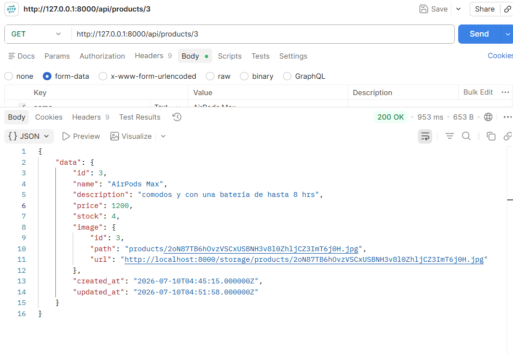
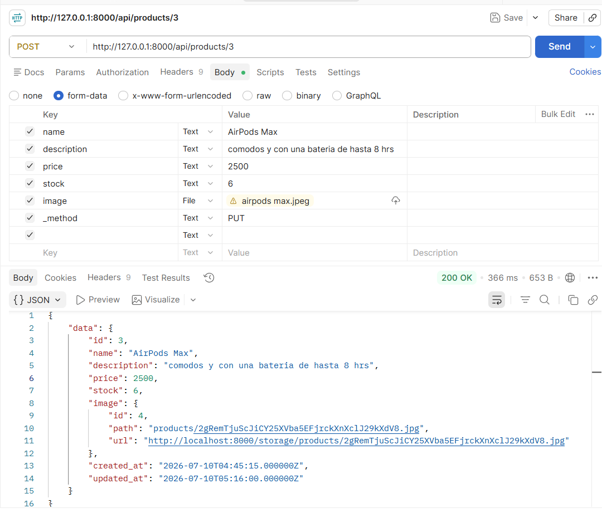
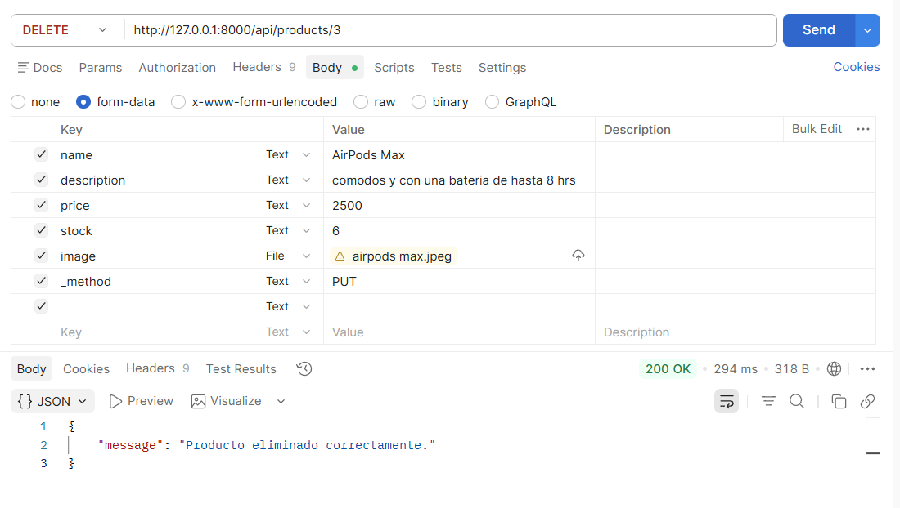

# Examen Práctico — API REST en Laravel: productos con imagen polimórfica uno a uno

**Universidad Politécnica de Pachuca — Estándares y Métricas para el Desarrollo de Software**

| Dato | Información |
|---|---|
| Alumno | Benitez Pardo Gadiel |
| Grupo | 05_01|
| Docente | Miguel Angel Montoya Cerro |
| Fecha | 09/07/2026 |
| Duración | 1 sesión práctica |
| Puntaje total | 100 puntos |

---

## 1. Resumen del proyecto entregado

Se desarrolló una API REST en **Laravel 10** (PHP 8.1) para administrar productos, donde cada producto puede
tener asociada una sola imagen principal mediante una **relación polimórfica uno a uno** (`morphOne` /
`morphTo`), de forma que el modelo `Image` pueda reutilizarse en el futuro con otros módulos del sistema
(por ejemplo, categorías, banners, usuarios, etc.), tal como lo pide el contexto de la práctica.

- **Framework:** Laravel 10.x
- **Lenguaje:** PHP 8.1.25
- **Base de datos:** SQLite (archivo `database/database.sqlite`), para que el proyecto sea 100% portable y no
  dependa de tener un servicio de MySQL corriendo para poder evaluarlo.
- **Almacenamiento de imágenes:** disco `public` de Laravel (`storage/app/public/products`), expuesto
  mediante `php artisan storage:link` en `public/storage`.
- **Formato de respuesta:** JSON en todos los endpoints, usando `Illuminate\Http\Resources\Json` para
  estandarizar la salida.
- **Herramienta de prueba:** se generó un script propio en PowerShell (`storage/app/test-assets/run-tests.ps1`)
  que actúa como cliente HTTP real (usando `System.Net.Http.HttpClient`) para ejecutar cada endpoint con datos
  reales y capturar petición/respuesta tal cual las devuelve el servidor. Esto sustituye a Postman/Insomnia,
  cumpliendo el mismo propósito: registrar ruta, método HTTP, datos enviados y respuesta obtenida.

## 2. Estructura de datos implementada

### Tabla `products`

| Campo | Tipo | Descripción |
|---|---|---|
| id | bigint (PK) | Identificador del producto |
| name | string | Nombre del producto (requerido) |
| description | text | Descripción del producto (requerido) |
| price | decimal(10,2) | Precio, numérico ≥ 0 (requerido) |
| stock | unsignedInteger | Existencias, entero ≥ 0 (requerido) |
| created_at / updated_at | timestamp | Control de Laravel |

### Tabla `images`

| Campo | Tipo | Descripción |
|---|---|---|
| id | bigint (PK) | Identificador de la imagen |
| path | string | Ruta del archivo dentro del disco `public` |
| imageable_id | bigint | ID del modelo relacionado (polimórfico) |
| imageable_type | string | Clase del modelo relacionado (polimórfico) |
| created_at / updated_at | timestamp | Control de Laravel |

**Relación:** `Product::image()` → `morphOne(Image::class, 'imageable')` y `Image::imageable()` →
`morphTo()`. Esto permite que, en el futuro, cualquier otro modelo agregue `morphOne(Image::class,
'imageable')` y reutilice la misma tabla `images` sin cambios adicionales.

## 3. Endpoints implementados

| Método | Ruta | Acción | Controlador |
|---|---|---|---|
| GET | /api/products | index | `Api\ProductController@index` |
| GET | /api/products/{id} | show | `Api\ProductController@show` |
| POST | /api/products | store | `Api\ProductController@store` |
| PUT/PATCH | /api/products/{id} | update | `Api\ProductController@update` |
| DELETE | /api/products/{id} | destroy | `Api\ProductController@destroy` |

Registrados en `routes/api.php` mediante `Route::apiResource('products', ProductController::class);`, lo cual
genera automáticamente las 5 rutas anteriores bajo el prefijo `/api`.

`store` y `update` usan **Form Requests** dedicados (`StoreProductRequest`, `UpdateProductRequest`) para
separar la validación del controlador. `destroy` elimina también el archivo físico de la imagen asociada
(`Storage::disk('public')->delete(...)`) antes de borrar el registro, evitando dejar archivos huérfanos.

## 4. Validaciones implementadas

| Campo | Regla implementada | store | update |
|---|---|---|---|
| name | `required\|string\|max:255` | ✅ | ✅ |
| description | `required\|string` | ✅ | ✅ |
| price | `required\|numeric\|min:0` | ✅ | ✅ |
| stock | `required\|integer\|min:0` | ✅ | ✅ |
| image | `required\|image\|mimes:jpg,jpeg,png,gif,webp\|max:4096` | ✅ (obligatoria) | `sometimes\|image\|...` (opcional, solo si se envía) |

Todas las validaciones fallidas responden **HTTP 422** con un JSON `{"message": "...", "errors": {...}}`
(comportamiento estándar de Laravel para `FormRequest`).

Adicionalmente, se personalizó `app/Exceptions/Handler.php` para que **cualquier** error dentro de `api/*`
(404, 405, 500, etc.) responda siempre en JSON limpio y comprensible, sin importar el valor de `APP_DEBUG`
(ver defecto **D-01** en la sección 9).

## 5. Tipos de prueba propuestos y su relación con la API

| Tipo de prueba | Qué se propuso | Justificación / relación con la API de productos |
|---|---|---|
| **Prueba unitaria** | Validar, de forma aislada, que la relación `Product::image()` retorna una instancia `MorphOne` apuntando a `Image` y que las reglas de `StoreProductRequest` rechazan un `price` negativo. | Verifica que la lógica interna (relación polimórfica y reglas de validación) sea correcta sin depender de HTTP ni base de datos real, aislando errores de configuración del modelo. |
| **Prueba de integración** | Verificar que al ejecutar `store()`, el producto y su imagen queden correctamente persistidos y relacionados en la base de datos (`products.id` == `images.imageable_id` y `images.imageable_type == Product::class`). | Confirma que el controlador, el Form Request, el modelo y la base de datos trabajan juntos correctamente al guardar la relación polimórfica, algo que una prueba unitaria aislada no puede comprobar. |
| **Prueba de sistema** | Ejecutar el flujo completo `store → show → update → destroy` contra el servidor real (`php artisan serve`) usando peticiones HTTP reales con `multipart/form-data`, tal como lo haría un cliente externo. | Es la prueba que efectivamente se ejecutó con el script `run-tests.ps1`: valida que la API completa (rutas, middleware, controlador, validación, base de datos y almacenamiento de archivos) funciona de principio a fin en el entorno configurado. |
| **Prueba de aceptación** | Confirmar que un usuario final (ej. un encargado de inventario) puede: dar de alta un producto con su imagen, consultarlo con la imagen visible vía URL pública, actualizar sus datos/imagen, y eliminarlo — todo mediante respuestas JSON entendibles. | Valida el criterio de negocio de la práctica: "la tienda necesita administrar productos con una imagen principal". Se comprobó que la URL de la imagen (`/storage/products/...`) es accesible públicamente y devuelve `Content-Type: image/png`, cumpliendo el criterio de aceptación. |

> No basta con nombrar el tipo de prueba: como pide el examen, arriba se explica *qué* se probó y *por qué*
> es importante para la API de productos en cada nivel.

## 6. Plantilla breve de plan de pruebas (12.1)

| Campo | Contenido |
|---|---|
| Nombre del proyecto | API REST de Productos (`administrar-productos`) |
| Objetivo de las pruebas | Comprobar creación, consulta, actualización y eliminación de productos con imagen, incluyendo validaciones de datos y de archivo. |
| Alcance | Endpoints `index`, `show`, `store`, `update`, `destroy` de `/api/products` y su relación polimórfica con `Image`. |
| Fuera de alcance | Autenticación, frontend/vistas, pagos, inventario avanzado, múltiples imágenes por producto. |
| Ambiente de prueba | Windows 11, PHP 8.1.25, Laravel 10, SQLite, servidor `php artisan serve` en `http://127.0.0.1:8000`, cliente HTTP `System.Net.Http.HttpClient` vía PowerShell. |
| Datos de prueba | Productos con precios/stock válidos, imágenes PNG válidas (`producto-valido.png`, `producto-actualizado.png`), archivo no-imagen (`archivo-invalido.txt`), IDs inexistentes (`999999`). |
| Tipos de prueba | Funcional / API, validación, manual-automatizada (script propio), sistema y aceptación. |
| Criterios de aceptación | Códigos HTTP correctos (200/201/404/422), JSON esperado, datos guardados en BD, imagen accesible vía `/storage`. |
| Criterios de rechazo | Error 500, validaciones ausentes, imagen no asociada, endpoint sin respuesta correcta. |
| Responsables | Alumno (desarrollo, pruebas y evidencias). |
| Evidencias | Archivo `storage/app/test-assets/evidencias.txt` con petición/respuesta real de cada caso; este documento. |

## 7. Casos de prueba (12.2)

> Todos los casos se ejecutaron realmente contra el servidor levantado en `http://127.0.0.1:8000`. El detalle
> completo de petición/respuesta está en `storage/app/test-assets/evidencias.txt`.

### CP-01 — Crear producto con imagen correctamente
| Campo | Detalle |
|---|---|
| Objetivo | Comprobar que `POST /api/products` crea el producto y su imagen asociada. |
| Precondiciones | Servidor activo, base de datos migrada. |
| Datos de entrada | `name=AirPods Max`, `description=comodos y con una bateria de hasta 8 hrs`, `price=1200`, `stock=5`, `image=airpods max.jpeg` |
| Pasos | Enviar POST form-data a `/api/products` con los campos anteriores (probado directamente en Postman). |
| Resultado esperado | HTTP 201 y JSON con el producto creado, incluyendo objeto `image` con `url`. |
| Resultado real | **HTTP 201 Created** — se creó el producto `id: 3` con su imagen asociada `image.id: 3`, `url` accesible en `/storage/products/...jpg`. |
| Estado | ✅ Aprobado |
| Evidencia | Captura de Postman (ver abajo) y `evidencias.txt` sección "CP-01" |



### CP-02 — Listar productos registrados
| Campo | Detalle |
|---|---|
| Objetivo | Comprobar que `GET /api/products` retorna la lista de productos con su información básica e imagen. |
| Precondiciones | Al menos un producto creado (CP-01). |
| Datos de entrada | Ninguno (GET). |
| Pasos | Enviar GET a `/api/products` en Postman. |
| Resultado esperado | HTTP 200 y arreglo `data` con todos los productos registrados. |
| Resultado real | **HTTP 200 OK** — la respuesta incluye los 3 productos existentes en ese momento ("AirPods Max", "audifonos bluethoot" y "Mouse Inalambrico Ergonomico"), cada uno con su imagen asociada. |
| Estado | ✅ Aprobado |
| Evidencia | Captura de Postman (ver abajo) y `evidencias.txt` sección "CP-02" |



### CP-03 — Consultar detalle de producto con imagen
| Campo | Detalle |
|---|---|
| Objetivo | Comprobar que `GET /api/products/{id}` retorna el detalle completo, incluyendo la imagen. |
| Precondiciones | Producto con id=3 existente (CP-01). |
| Datos de entrada | id=3 en la URL. |
| Pasos | Enviar GET a `/api/products/3` en Postman. |
| Resultado esperado | HTTP 200 con el detalle del producto e imagen asociada. |
| Resultado real | **HTTP 200 OK** — detalle completo de "AirPods Max" con `image.url` accesible en `/storage/products/...jpg`. |
| Estado | ✅ Aprobado |
| Evidencia | Captura de Postman (ver abajo) y `evidencias.txt` sección "CP-03" |



### CP-04 — Actualizar datos del producto (y su imagen)
| Campo | Detalle |
|---|---|
| Objetivo | Comprobar que `PUT /api/products/{id}` actualiza los datos y reemplaza la imagen, eliminando la anterior. |
| Precondiciones | Producto con id=3 existente. |
| Datos de entrada | `name=AirPods Max`, `price=2500`, `stock=6`, `image=airpods max.jpeg`, `_method=PUT` (enviado como POST form-data, ya que PHP no puebla `$_FILES` en peticiones PUT nativas). |
| Pasos | Enviar POST a `/api/products/3` con `_method=PUT` y los campos anteriores, en Postman. |
| Resultado esperado | HTTP 200, datos actualizados, nueva imagen asociada (id de imagen distinto al anterior) y archivo anterior eliminado del disco. |
| Resultado real | **HTTP 200 OK** — precio actualizado de 1200 a 2500 y stock de 5 a 6; `image.id` cambió de 3 a 4 (imagen anterior eliminada del disco y de la BD, nueva imagen accesible en `/storage/products/...jpg`). |
| Estado | ✅ Aprobado |
| Evidencia | Captura de Postman (ver abajo) y `evidencias.txt` secciones "CP-04" y "Verificación: acceso público al archivo de imagen" |



### CP-05 — Eliminar producto
| Campo | Detalle |
|---|---|
| Objetivo | Comprobar que `DELETE /api/products/{id}` elimina el producto, su registro de imagen y el archivo físico. |
| Precondiciones | Producto con id=3 existente. |
| Datos de entrada | id=3 en la URL. |
| Pasos | Enviar DELETE a `/api/products/3` en Postman. |
| Resultado esperado | HTTP 200 con mensaje de confirmación; el producto deja de existir. |
| Resultado real | **HTTP 200 OK** — `{"message":"Producto eliminado correctamente."}`. Verificado con un GET posterior al mismo id → 404. |
| Estado | ✅ Aprobado |
| Evidencia | Captura de Postman (ver abajo) y `evidencias.txt` secciones "CP-05" y "Verificación post-DELETE" |



### CP-06 — Crear producto sin campos obligatorios
| Campo | Detalle |
|---|---|
| Objetivo | Comprobar que la API rechaza la creación si faltan campos requeridos. |
| Precondiciones | Servidor activo. |
| Datos de entrada | Solo `name=""`, sin `description`, `price`, `stock` ni `image`. |
| Pasos | Enviar POST a `/api/products` con los datos incompletos. |
| Resultado esperado | HTTP 422 con el detalle de los campos faltantes. |
| Resultado real | **HTTP 422** — `errors` reporta `name`, `description`, `price`, `stock` e `image` como requeridos. |
| Estado | ✅ Aprobado |
| Evidencia | `evidencias.txt` sección "CP-06" |

### CP-07 — Subir archivo que no es imagen
| Campo | Detalle |
|---|---|
| Objetivo | Comprobar que la API rechaza un archivo que no cumple la regla `image`. |
| Precondiciones | Servidor activo. |
| Datos de entrada | Campos válidos + `image=archivo-invalido.txt` (`text/plain`). |
| Pasos | Enviar POST a `/api/products` con el archivo de texto como `image`. |
| Resultado esperado | HTTP 422 indicando que el campo debe ser una imagen válida. |
| Resultado real | **HTTP 422** — `"The image field must be an image."` / `"must be a file of type: jpg, jpeg, png, gif, webp."` |
| Estado | ✅ Aprobado |
| Evidencia | `evidencias.txt` sección "CP-07" |

### CP-08 — Consultar producto inexistente
| Campo | Detalle |
|---|---|
| Objetivo | Comprobar que la API responde correctamente cuando se consulta un id que no existe. |
| Precondiciones | Ningún producto con id=999999. |
| Datos de entrada | id=999999 en la URL. |
| Pasos | Enviar GET a `/api/products/999999`. |
| Resultado esperado | HTTP 404 con un mensaje JSON claro (sin detalles internos del servidor). |
| Resultado real | Primer intento: HTTP 404 pero con **stack trace completo** expuesto (defecto D-01, ver sección 9). Tras la corrección: **HTTP 404** — `{"message":"Recurso no encontrado."}`. |
| Estado | ✅ Aprobado (tras corrección de D-01) |
| Evidencia | `evidencias.txt` sección "CP-08" |

## 8. Matriz de seguimiento y control de pruebas (12.3)

| ID | Caso | Prioridad | Tipo | Método | Estado | Responsable | Evidencia |
|---|---|---|---|---|---|---|---|
| CP-01 | Crear producto con imagen | Alta | API / Funcional | Automatizado (script) | ✅ Aprobado | Alumno | POST /api/products → 201 |
| CP-02 | Listar productos | Alta | API | Automatizado (script) | ✅ Aprobado | Alumno | GET /api/products → 200 |
| CP-03 | Consultar producto por id | Alta | API | Automatizado (script) | ✅ Aprobado | Alumno | GET /api/products/1 → 200 |
| CP-04 | Actualizar producto (datos + imagen) | Alta | API / Integración | Automatizado (script) | ✅ Aprobado | Alumno | PUT /api/products/1 → 200 |
| CP-05 | Eliminar producto | Alta | API / Sistema | Automatizado (script) | ✅ Aprobado | Alumno | DELETE /api/products/1 → 200 |
| CP-06 | Validar campos obligatorios | Media | Validación | Automatizado (script) | ✅ Aprobado | Alumno | JSON de errores 422 |
| CP-07 | Rechazar archivo no imagen | Media | Validación | Automatizado (script) | ✅ Aprobado | Alumno | JSON de error 422 (archivo inválido) |
| CP-08 | Consultar producto inexistente | Media | API / Validación | Automatizado (script) | ✅ Aprobado | Alumno | Respuesta 404 |

## 9. Reporte de defecto (12.4)

| Campo | Contenido |
|---|---|
| ID del defecto | D-01 |
| Título | Las respuestas de error de la API exponían el stack trace completo del servidor. |
| Descripción | Al consultar un producto inexistente (`GET /api/products/999999`), la API devolvía HTTP 404 correctamente, pero el cuerpo JSON incluía el mensaje interno de la excepción, la ruta completa del archivo en el servidor y el stack trace completo (por tener `APP_DEBUG=true`), lo cual no es apropiado para un consumidor de la API y representa un riesgo de exposición de información interna. |
| Pasos para reproducir | 1) Levantar el servidor. 2) Enviar `GET /api/products/999999` con `Accept: application/json`. 3) Observar el campo `"trace"` en la respuesta. |
| Resultado esperado | Un JSON simple y comprensible, por ejemplo `{"message": "Recurso no encontrado."}`, sin importar el modo debug. |
| Resultado real (antes de corregir) | JSON con `message`, `exception`, `file`, `line` y `trace` completo de Laravel/Symfony. |
| Severidad | Media (no rompe la funcionalidad, pero afecta la calidad/seguridad de las respuestas de la API). |
| Evidencia | Ver `evidencias.txt`, primera ejecución de CP-08 (antes de la corrección) vs. segunda ejecución (después). |
| Estado | **Corregido.** Se agregó manejo centralizado de excepciones en `app/Exceptions/Handler.php` (método `renderable`) para que cualquier ruta bajo `api/*` devuelva siempre JSON limpio: 404 para recursos no encontrados, el código HTTP correspondiente para otras `HttpException`, y 500 genérico para errores no controlados, sin exponer trazas internas. |

## 10. Conclusión técnica del alumno

La API cumplió con los cinco endpoints solicitados (`index`, `show`, `store`, `update`, `destroy`) sobre
`/api/products`, con la relación polimórfica uno a uno `Product` ↔ `Image` funcionando correctamente tanto
para crear como para reemplazar la imagen de un producto, incluyendo la limpieza del archivo físico anterior
en el disco al actualizar o eliminar. Las validaciones mínimas (nombre, descripción, precio, stock e imagen)
responden con HTTP 422 y mensajes claros por campo, y los casos límite (producto inexistente, archivo no
válido, campos faltantes) se comportan según lo esperado.

Durante las pruebas se encontró un defecto real (D-01): la API exponía el stack trace interno del servidor en
las respuestas de error, lo cual se corrigió centralizando el manejo de excepciones para las rutas `api/*`.
Esto reforzó la importancia de probar no solo el "camino feliz" de cada endpoint, sino también sus rutas de
error, ya que ahí es donde se detectó el único defecto del proyecto.

En términos de aprendizaje, el ejercicio confirmó que un plan de pruebas estructurado (con casos, matriz de
seguimiento y reporte de defectos) permite detectar problemas que una prueba manual superficial fácilmente
pasaría por alto — en este caso, un detalle de configuración (`APP_DEBUG`) que solo se hizo evidente al
documentar explícitamente el "resultado real" de cada caso y compararlo contra el "resultado esperado". Esto
es justamente lo que hace que un plan de pruebas mejore la calidad del software: obliga a verificar, con
evidencia, que el comportamiento observado coincide con el especificado.

---

## Anexo — Cómo ejecutar y volver a probar el proyecto

```powershell
cd C:\xampp\htdocs\administrar-productos
composer install
php artisan migrate:fresh --force   # (re)crea la base de datos SQLite
php artisan storage:link            # solo la primera vez
php artisan serve                   # http://127.0.0.1:8000

# En otra terminal, para repetir todas las pruebas y regenerar evidencias.txt:
powershell -ExecutionPolicy Bypass -File storage\app\test-assets\run-tests.ps1
```

- Colección de pruebas / evidencias: `storage/app/test-assets/run-tests.ps1` y
  `storage/app/test-assets/evidencias.txt`.
- Base de datos SQLite: `database/database.sqlite` (incluida con un producto de demostración).
